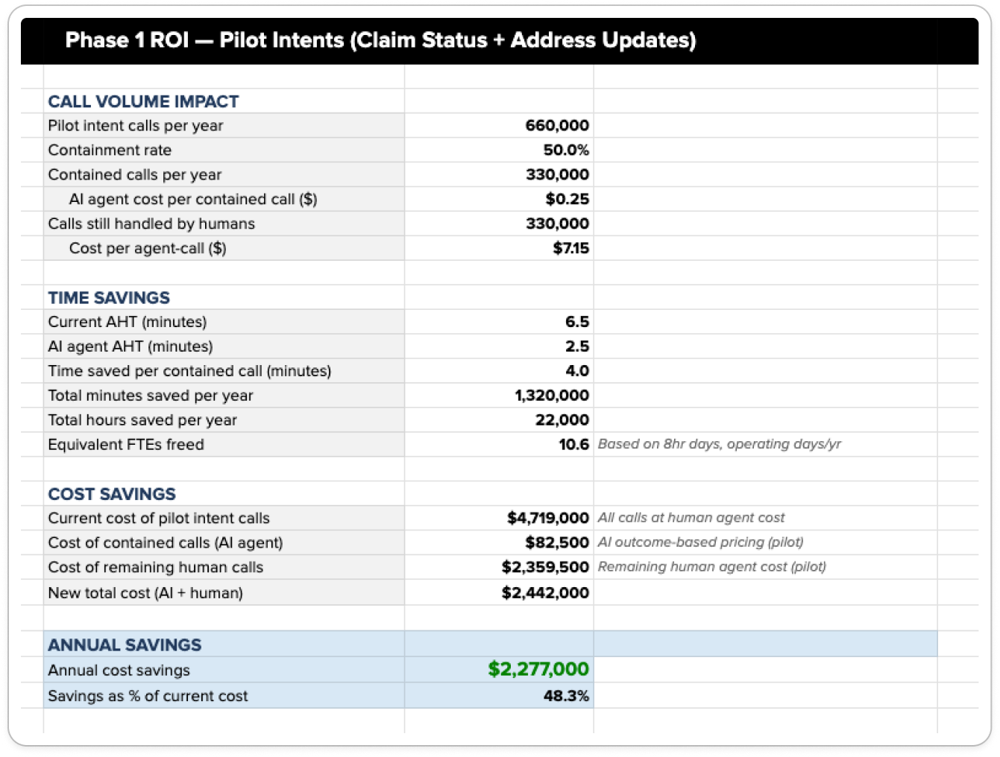

# ROI Calculator — Phase 1

Estimated annual savings from automating the **Phase 1 pilot intents** (Claim Status + Address Updates) at the 50% containment target.

> **Headline:** ~$2.3M annual savings · 48% cost reduction · 10.6 FTE-equivalents freed

---

## Inputs

### Call volume (Phase 1 scope)

| Input | Value | Source |
|-------|-------|--------|
| Pilot intent calls per year | 660,000 | Subset of EverSure's 1.2M total — Claim Status + Address Updates only |
| Containment rate | 50% | Pilot success criterion (within 30 days of go-live) |
| Contained calls per year | 330,000 | Derived |
| Calls still handled by humans | 330,000 | Derived |

### Time

| Input | Value |
|-------|-------|
| Current AHT | 6.5 min |
| AI agent AHT (contained) | 2.5 min |
| Time saved per contained call | 4.0 min |

### Cost

| Input | Value |
|-------|-------|
| Cost per agent-call (loaded) | $7.15 (= 6.5 min × $1.10/min) |
| AI cost per contained call | $0.25 (outcome-based pricing) |

---

## Calculation

| Line | Calc | Value |
|------|------|-------|
| Current cost of pilot intent calls | 660,000 × $7.15 | $4,719,000 |
| Cost of contained calls (AI) | 330,000 × $0.25 | $82,500 |
| Cost of remaining human calls | 330,000 × $7.15 | $2,359,500 |
| **New total cost (AI + human)** | | **$2,442,000** |
| **Annual savings** | $4,719,000 − $2,442,000 | **$2,277,000** |
| Savings as % of current cost | | **48.3%** |

### Time savings

| Metric | Value |
|--------|-------|
| Total minutes saved per year | 1,320,000 |
| Total hours saved per year | 22,000 |
| Equivalent FTEs freed | **10.6** *(based on 8hr days, operating days/yr)* |

---

## What's Not Counted

The Phase 1 model is deliberately conservative. Excluded upside:

- **AHT savings on escalated calls** — coverage/eligibility calls still escalate, but AI pre-verifies identity and captures the question. Estimated 2-3 min off the human side per call. Not in the Phase 1 number.
- **Phase 2 expansion** — adding payment Q&A and other intents compounds savings without a second integration build.
- **24/7 availability** — current ops likely close after-hours; AI handles overnight at no incremental staffing cost.
- **CSAT-driven retention value** — faster, more available service typically lifts NPS.
- **Reduced agent attrition** — repetitive calls are a top driver of contact-center turnover; offloading them improves retention (and the cost of training a new rep is $5K-$15K).

---

## How to Read This

This is a **pilot business case**, not a full forecast. Two reasons it's intentionally conservative:

1. **Phase 1 only.** Only the two intents being shipped first — Claim Status and Address Updates. Excludes Payment Questions (Phase 2) and the AHT savings on Coverage/Eligibility escalations.
2. **Containment rates ramp.** Week 1 is typically 10-30%; the 50% target is a 30-day exit number. The model uses the steady-state rate, so first-month actuals will look worse.

The math is meant to be defensible in front of a CFO — not impressive in a deck.
